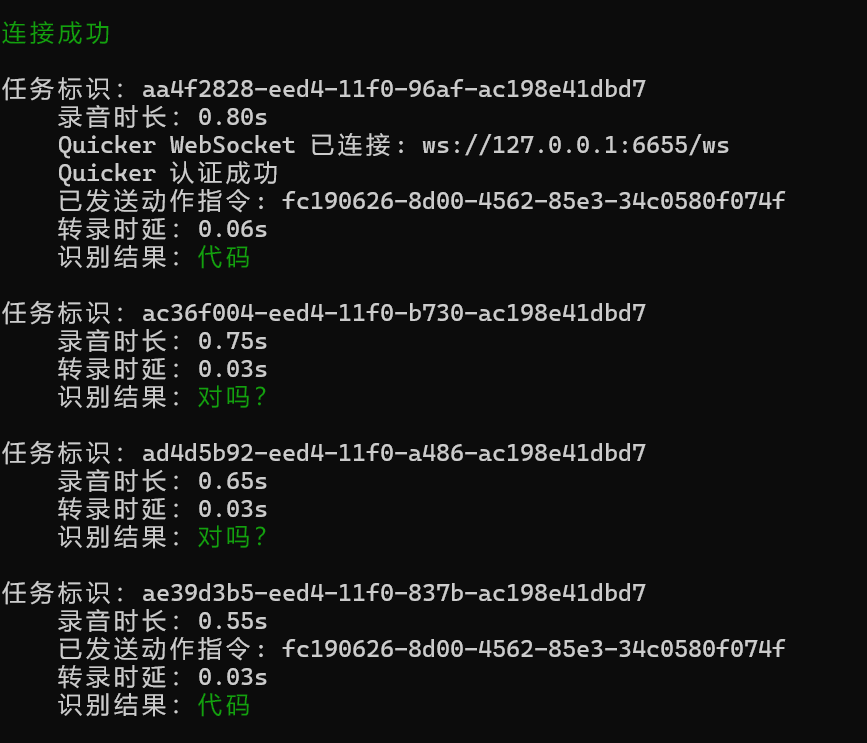

## 介绍

这仓库它是基于这个版本。我不会跟进作者的更新了，作者实际上也没有怎么更新，现在的版本已经很够我们用：https://github.com/HaujetZhao/CapsWriter-Offline/tree/a072f5312031e31706b294e9242d516fb8979fc6

我省流介绍一下：
1. 点开 https://github.com/shandianchengzi/CapsWriter-Offline-Windows-Edit/releases/tag/1 下载以下3个文件：
   1. Source code (zip)：下载之后先解压，然后把整个文件夹打开，这个文件夹是根目录。
   2. ffmpeg.exe：放到根目录。
   3. models.zip：解压后整个文件夹一起放到根目录。
2. 双击 `start_client.exe` 启动客户端，双击 `start_server.exe` 启动服务端。
3. 按下 `CapsLock` 键，开始录音，松开 `CapsLock` 键，结束录音，识别结果立马被输入。
4. 除此之外，还支持音视频转录的功能，拖到 `start_client.exe` 上面（或通过命令行参数指定文件路径），会自动识别文件类型，然后转录成文字。

如果你需要连接 Quicker 动作或者进行一些其他的配置，可以自行查看 `config.py`、`hot-rule.txt`、`hot-en.txt`、`hot-zh.txt` 这几个文件。

要想连接 Quicker 动作，还要打开 Quicker 端的 WebSocket 设置，详见 Quicker 官方文档：[WebSocket 服务 - Quicker](https://getquicker.net/KC/Manual/Doc/websocketservice)。

工具更详细可以去看作者的介绍，也可以直接点开我的这个 [readme-raw.md](readme-raw.md)，我拷贝了一份。

接下来解释一下我的额外的更新。

## 额外的更新

首先是配置相关的设定，我和作者有区别，然后你们可以调整和作者一致，这个都是个人爱好。

1. 实时更新一些网安常用的热词
2. 配置里面禁用了保存录音文件的功能

安装方式也有更新调整作者的那种安装方式，它相对来说不太方便用来更新配置和一些 server 和 client 的操作，因为他的代码的部分在也被打包到他的 release 的包里面去了，他没有被放到源代码那个环节……所以这里我就直接单开一个 Windows 的版本，然后不需要改动的exe，就永远也不要改动了，然后这个 git 仓库就只存需要改动的内容。

功能上的更新：
1. 增加特定的词响应相关的Quicker动作，支持hot-rule.txt中添加动作的关联，如：
代码 = fc190626-8d00-4562-85e3-34c0580f074f。关于这个特性，我发了篇博客，更详细的介绍，可以在博客里面看：[【开源工具】离线语音识别接入Quicker，冬天懒得打字甚至懒得动就这样｜CapsWriter-Offline-Windows-Edit-CSDN博客](https://blog.csdn.net/qq_46106285/article/details/156833033)

2. 支持不保存wav文件，只保存md文件。

3. 新增对音视频文件的转录功能时的热词替换功能。
